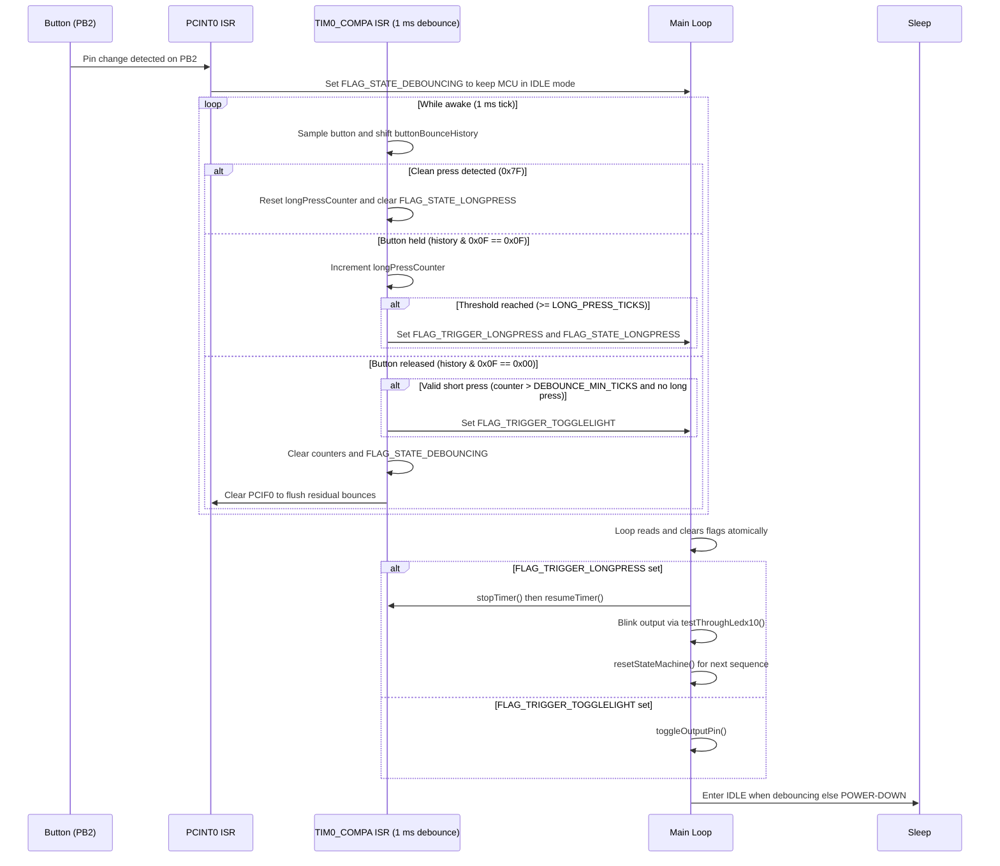

```mermaid
sequenceDiagram
    participant Button as Button (PB2)
    participant PCINT0 as PCINT0 ISR
    participant TimerISR as TIM0_COMPA ISR (1 ms debounce)
    participant Main as Main Loop

    Button->>PCINT0: Pin change detected on PB2
    PCINT0->>Main: Set FLAG_STATE_DEBOUNCING to keep MCU in IDLE mode

    loop While awake (1 ms tick)
        TimerISR->>TimerISR: Sample button and shift buttonBounceHistory
        alt Clean press detected (0x7F)
            TimerISR->>TimerISR: Reset longPressCounter and clear FLAG_STATE_LONGPRESS
        else Button held (history & 0x0F == 0x0F)
            TimerISR->>TimerISR: Increment longPressCounter
            alt Threshold reached (>= LONG_PRESS_TICKS)
                TimerISR->>Main: Set FLAG_TRIGGER_LONGPRESS and FLAG_STATE_LONGPRESS
            end
        else Button released (history & 0x0F == 0x00)
            alt Valid short press (counter > DEBOUNCE_MIN_TICKS and no long press)
                TimerISR->>Main: Set FLAG_TRIGGER_TOGGLELIGHT
            end
            TimerISR->>TimerISR: Clear counters and FLAG_STATE_DEBOUNCING
            TimerISR->>PCINT0: Clear PCIF0 to flush residual bounces
        end
    end

    Main->>Main: Loop reads and clears flags atomically
    alt FLAG_TRIGGER_LONGPRESS set
        Main->>TimerISR: stopTimer() then resumeTimer()
        Main->>Main: Blink output via testThroughLedx10()
        Main->>Main: resetStateMachine() for next sequence
    else FLAG_TRIGGER_TOGGLELIGHT set
        Main->>Main: toggleOutputPin()
    end

    Main->>Sleep: Enter IDLE when debouncing else POWER-DOWN
```